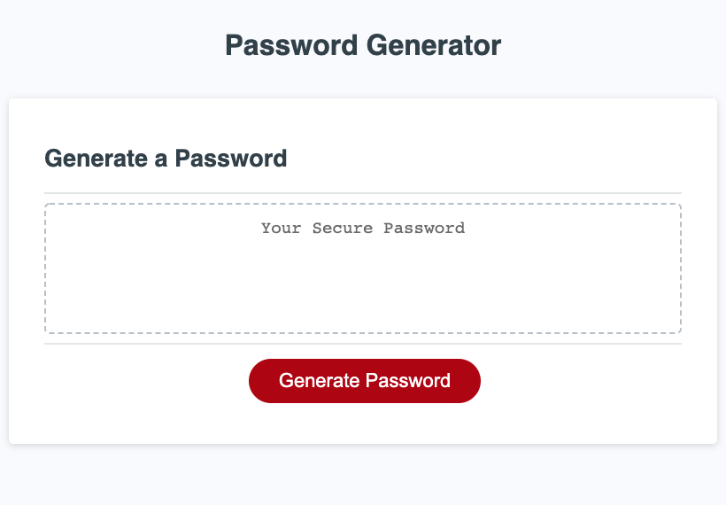

# Password Generator

## Description

This project involved creating a random password generator application. This project uses HTML, CSS, and Javscript languages. HTML and CSS was used to style the password generator website and Javascript was used to create the random password.

## Table of Contents

* [Description](#description)
* [User Story](#user-story)
* [Installation](#installation)
* [Usage](#usage)
* [License](#license)
* [Contributing](#contributing)
* [Tests](#tests)
* [Questions](#questions)
* [Deployed Application URL](#deployed-application-URL)

## User Story

AS AN employee with access to sensitive data
I WANT to randomly generate a password that meets certain criteria
SO THAT I can create a strong password that provides greater security

## Installation

No installation needed. Once you click the deployed application link, it is ready to go.

## Usage

Click on Generate Password. This will display the following prompts: -Type in how many characters you want in your password. (character min 8 and character max 128). You must choose at least one of the following below in order for a password to be generated. 
- Choose if you want lowercase letters in your password. 
- Choose if you want uppercase letters in your password. 
- Choose if you want numbers in your password. 
- Choose if you want special characters in your password.

A password will be generated based on the selected options. On the first prompt, if the number typed in does not meet the character min/max or you click on cancel, the display prompts will be exited and a password will not be generated.

## License

## Contributing

Please follow standard contributing guidelines.

## Tests

No tests to run.

## Questions

For any questions, please contact kendayao at kendayao@gmail.com

## Deployed Application URL

Link to deployed application: https://kendayao.github.io/Password-Generator/

